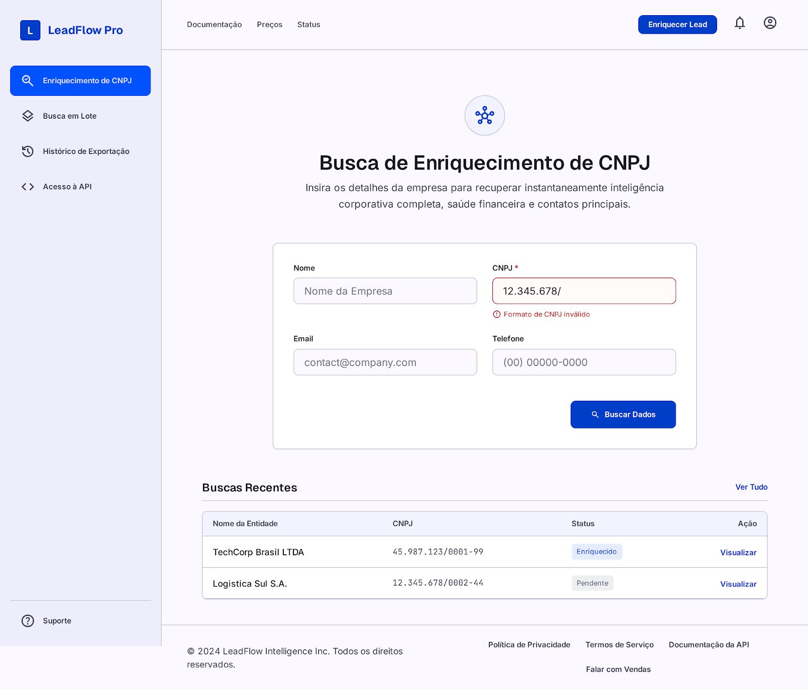
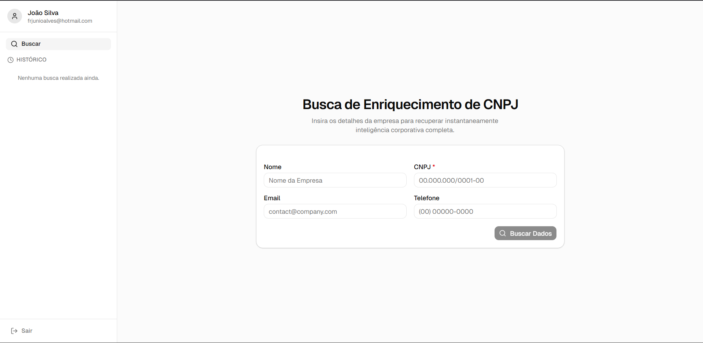
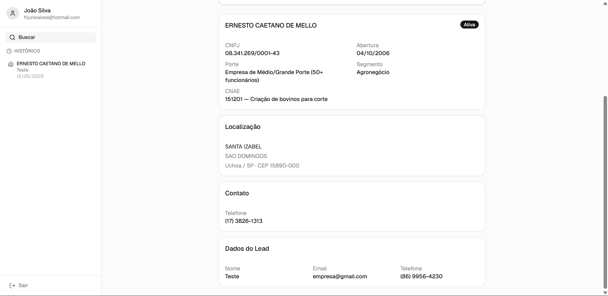

# Enriquecedor de Leads — Frontend

SPA React que permite enriquecer dados de leads via CNPJ. O usuário faz login, preenche o formulário com nome, e-mail, telefone e CNPJ, e recebe dados estruturados da empresa (segmento, faixa de funcionários, endereço, fuso horário). O histórico de buscas fica disponível na barra lateral.

## Demo

A aplicação está disponível em produção, com deploy realizado na **Azure Web Service** e banco de dados PostgreSQL hospedado na **Hetzner**:

**[https://lead-enricher-f9hrb2fee6asdpa6.canadacentral-01.azurewebsites.net/](https://lead-enricher-f9hrb2fee6asdpa6.canadacentral-01.azurewebsites.net/)**

O pipeline de CI/CD está configurado e funcionando via GitHub Actions — qualquer push na branch `main` dispara o build e o deploy automático na Azure Web Service.

## Screenshots

**Login**



**Formulário de busca**



**Resultado do enriquecimento**



---

## Stack

| Tecnologia | Versão | Papel |
|---|---|---|
| React | 19 | Base da aplicação |
| TypeScript | ~6.0 | Tipagem estática |
| Vite | 8 | Build e dev server |
| TailwindCSS | 4 | Estilização utilitária |
| shadcn/ui | 4 | Componentes acessíveis (Button, Card, Input, Badge, Form) |
| React Hook Form | 7 | Gerenciamento de formulário |
| Zod | 4 | Validação de schema |
| React Query | 5 | Cache e estado de requisições |
| Axios | 1 | Cliente HTTP |
| Zustand | 5 | Estado global de autenticação |
| react-router-dom | 7 | Roteamento SPA |
| react-imask | 7 | Máscara de CNPJ e telefone |

## Pré-requisitos

- Docker e Docker Compose (opção A)
- Node.js 20+ e npm 10+ (opção B)
- Backend rodando em `http://localhost:3000`

## Como rodar

### Opção A — Docker (recomendado)

O `VITE_API_URL` já tem `http://localhost:3000` como valor padrão no `dockercompose.yml`, então basta subir:

```bash
docker compose up --build
```

Para apontar para outra URL (ex: API em produção), passe a variável explicitamente:

```bash
VITE_API_URL=https://sua-api.exemplo.com docker compose up --build
```

| Serviço | Porta no host |
|---|---|
| Frontend (nginx) | `8080` |

Acesse `http://localhost:8080`.

### Opção B — Desenvolvimento local

```bash
npm install
```

Crie `.env.local` na raiz:

```env
VITE_API_URL=http://localhost:3000
```

```bash
npm run dev
```

Acesse `http://localhost:5173`.

## Comandos

| Comando | Descrição |
|---|---|
| `npm run dev` | Inicia o servidor de desenvolvimento (HMR) |
| `npm run build` | Compila TypeScript e gera o bundle de produção |
| `npm run preview` | Serve o build de produção localmente |
| `npm run lint` | Executa o ESLint |

## Estrutura do projeto

```
src/
├── api/
│   ├── client.ts        # Axios instance + interceptor JWT
│   ├── auth.ts          # register, login
│   ├── leads.ts         # postEnrichLead
│   └── history.ts       # getLeadHistory
├── components/
│   ├── CompanyResult/
│   │   ├── CompanyCard.tsx   # Dados cadastrais
│   │   ├── ContactCard.tsx   # Telefone e e-mail
│   │   ├── LocationCard.tsx  # Endereço + fuso
│   │   ├── LeadCard.tsx      # Dados do lead
│   │   └── index.tsx
│   ├── ui/              # shadcn/ui primitivos
│   ├── Layout.tsx       # Shell com sidebar
│   ├── LeadForm.tsx     # Formulário principal
│   └── Sidebar.tsx      # Histórico + logout
├── hooks/
│   ├── useEnrichLead.ts # React Query — POST enrich
│   └── useLeadHistory.ts # React Query — GET history
├── pages/
│   ├── LoginPage.tsx
│   ├── RegisterPage.tsx
│   ├── HomePage.tsx
│   └── HistoryPage.tsx
├── schemas/
│   ├── leadSchema.ts    # Zod — validação do formulário
│   └── authSchema.ts    # Zod — login e registro
├── store/
│   └── authStore.ts     # Zustand — token + user (persiste em localStorage)
├── types/
│   └── company.ts       # EnrichedCompany e tipos do domínio
└── utils/
    ├── mapHistory.ts    # Transforma LeadHistory para EnrichedCompany
    └── validateCNPJ.ts  # Validação do dígito verificador
```

## Rotas

| Rota | Página | Protegida |
|---|---|---|
| `/login` | LoginPage | Não |
| `/register` | RegisterPage | Não |
| `/` | HomePage | Sim (Layout) |
| `/history/:id` | HistoryPage | Sim (Layout) |

## Fluxo de autenticação

O token JWT é armazenado via Zustand + `persist` (localStorage). O Axios client injeta o header `Authorization: Bearer <token>` automaticamente em todas as requisições. Ao fazer logout, o store é limpo e o usuário é redirecionado para `/login`.

---

## Decisões de projeto e justificativas

Escolhi React + Vite pois acho simples sua implementação. Desde o princípio queria que o front-end e o back-end fossem separados, por isso não escolhi um framework fullstack. Fiz esse projeto de ponta a ponta e me diverti muito: desde a concepção da arquitetura até a aplicação de conceitos de DevOps como CI/CD, Docker, Gitflow e deploy na Azure Web Service.

### Migração de npm para pnpm

Durante o projeto migrei o gerenciador de pacotes de **npm** para **pnpm**. A motivação principal foi mitigar os riscos dos recentes ataques à cadeia de suprimentos (supply chain attacks) direcionados a módulos do npm. O pnpm isola as dependências de forma mais estrita — cada pacote só tem acesso às suas próprias dependências declaradas, impedindo que um pacote malicioso acesse dependências de outros pacotes transitivamente. Isso reduz significativamente a superfície de ataque em comparação ao modelo de `node_modules` hoisting do npm.

A migração em si foi simples — remover `package-lock.json` e `node_modules`, rodar `pnpm install` para gerar o lockfile e ajustar o `.gitignore` — mas expôs dois bugs no Dockerfile:

**Bug 1 — comandos npm remanescentes no Dockerfile:** após trocar o gerenciador no ambiente local, o Dockerfile ainda usava `npm ci` e `npm run build`. O build na Docker quebrou porque o `npm` não encontrava o `package-lock.json` (que havia sido removido). A correção exigiu ativar o pnpm via `corepack`, copiar o `pnpm-lock.yaml` e substituir todos os comandos npm pelos equivalentes pnpm:

```dockerfile
RUN corepack enable && corepack prepare pnpm@latest --activate
COPY package.json pnpm-lock.yaml ./
RUN pnpm install --frozen-lockfile
RUN pnpm run build
```

**Bug 2 — `node:20-alpine` incompatível com `pnpm@latest`:** o `corepack prepare pnpm@latest` falhou na imagem `node:20-alpine` porque a versão mais recente do pnpm exige Node.js 22+. A solução foi atualizar a imagem base para `node:22-alpine` e adicionar `--ignore-scripts` para evitar scripts de pós-instalação em ambiente CI:

```dockerfile
FROM node:22-alpine AS builder
ENV CI=true
RUN pnpm install --frozen-lockfile --ignore-scripts
```

No total, a migração e a resolução dos dois bugs custaram cerca de 1 hora extra de depuração.

---

## Como a IA te ajudou a construir essa solução

A principal ferramenta de IA utilizada neste projeto foi o **[Claude Code](https://claude.ai/code)** — o CLI oficial da Anthropic — com o modelo **Claude Sonnet 4.6**. O Claude Code foi integrado diretamente ao fluxo de desenvolvimento no terminal, permitindo interações contextualizadas com o código real do repositório.

A IA foi utilizada principalmente para tirar dúvidas sobre features e discutir melhores formas de implementação.

No início do projeto ela não foi usada com frequência para geração de código, pois a fase inicial envolveu definir a arquitetura e experimentar bibliotecas novas como Zod e React Query. Essa exploração foi feita de forma autônoma para consolidar o entendimento antes de delegar qualquer implementação.

Após essa etapa, adotei um fluxo estruturado de desenvolvimento com IA via **Claude Code (Sonnet 4.6)**:

1. **Descrição completa da feature** — escopo, limitações, padrões a seguir e comportamento esperado eram documentados antes de qualquer código.
2. **Geração de um arquivo `.md`** — o Claude Code produzia um documento descrevendo a implementação proposta, que eu revisava e corrigia conforme necessário.
3. **Implementação** — somente após o `.md` estar aprovado o Claude Code gerava o código diretamente nos arquivos do projeto, e eu verificava se o resultado estava alinhado com o que havia sido especificado.

O Claude Code com Sonnet 4.6 se destacou pela capacidade de ler, editar e criar arquivos no repositório com precisão, além de manter contexto entre múltiplas etapas de implementação — o que acelerou significativamente o desenvolvimento sem abrir mão da qualidade.

Todas as decisões de arquitetura, revisão de código e validação dos resultados foram feitas por mim ao longo de todo o processo.

---

## Tempo gasto na execução do desafio

Entre 10 e 15 horas.

---

## Se você tivesse mais tempo, o que teria feito?

- Teria feito uma documentação melhor, listando os requisitos, e aplicado de forma mais adequada os conceitos de Gitflow.
- **Testes automatizados**: testes de componente com Vitest + Testing Library.
- **Refresh token**: o JWT expira em 7 dias sem renovação automática; implementaria um fluxo de refresh para manter a sessão ativa de forma segura.
